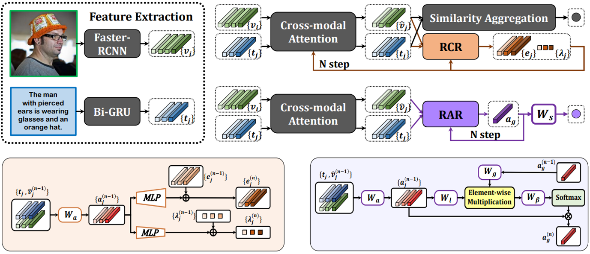

# RCAR
*PyTorch implementation for TIP2023 paper of [**“Plug-and-Play Regulators for Image-Text Matching”**](https://arxiv.org/abs/2303.13371).* 

*It is built on top of the [SGRAF](https://github.com/Paranioar/SGRAF), [GPO](https://github.com/woodfrog/vse_infty) and [Awesome_Matching](https://github.com/Paranioar/Awesome_Matching_Pretraining_Transfering).*  

*If any problems, please contact me at r1228240468@gmail.com. (diaohw@mail.dlut.edu.cn is deprecated)*

## Introduction

**The framework of RCAR:**



**The reported results (One can import GloVe Embedding or BERT for better results)**
<table>
   <tr> <td rowspan="2">Dataset</td> <td rowspan="2", align="center">Module</td> 
        <td colspan="3", align="center">Sentence retrieval</td> <td colspan="3", align="center">Image retrieval</td> </tr>
   <tr> <td>R@1</td><td>R@5</td><td>R@10</td> <td>R@1</td><td>R@5</td><td>R@10</td> </tr>
   <tr> <td rowspan="3">Flick30k</td>
        <td>T2I</td> <td>79.7</td><td>95.0</td><td>97.4</td> <td>60.9</td><td>84.4</td><td>90.1</td> </tr>
   <tr> <td>I2T</td> <td>76.9</td><td>95.5</td><td>98.0</td> <td>58.8</td><td>83.9</td><td>89.3</td> </tr>
   <tr> <td>ALL</td> <td>82.3</td><td>96.0</td><td>98.4</td> <td>62.6</td><td>85.8</td><td>91.1</td> </tr>
   <tr> <td rowspan="3">MSCOCO1k</td>
        <td>T2I</td> <td>79.1</td><td>96.5</td><td>98.8</td> <td>63.9</td><td>90.7</td><td>95.9</td> </tr>
   <tr> <td>I2T</td> <td>79.3</td><td>96.5</td><td>98.8</td> <td>63.8</td><td>90.4</td><td>95.8</td> </tr>
   <tr> <td>ALL</td> <td>80.9</td><td>96.9</td><td>98.9</td> <td>65.7</td><td>91.4</td><td>96.4</td> </tr>
   <tr> <td rowspan="3">MSCOCO5k</td>
        <td>T2I</td> <td>59.1</td><td>84.8</td><td>91.8</td> <td>42.8</td><td>71.5</td><td>81.9</td> </tr>
   <tr> <td>I2T</td> <td>58.4</td><td>84.6</td><td>91.9</td> <td>41.7</td><td>71.4</td><td>81.7</td> </tr>
   <tr> <td>ALL</td> <td>61.3</td><td>86.1</td><td>92.6</td> <td>44.3</td><td>73.2</td><td>83.2</td> </tr>
</table>

## Requirements 
Utilize `pip install -r requirements.txt` for the following dependencies.

*  Python 3.7.11  
*  PyTorch 1.7.1   
*  NumPy 1.21.5 
*  Punkt Sentence Tokenizer:
```python
import nltk
nltk.download()
> d punkt
```

## Download data and vocab
We follow [SCAN](https://github.com/kuanghuei/SCAN) to obtain image features and vocabularies, which can be downloaded by using:

```bash
https://www.kaggle.com/datasets/kuanghueilee/scan-features
```
Another download link is available below：

```bash
https://drive.google.com/drive/u/0/folders/1os1Kr7HeTbh8FajBNegW8rjJf6GIhFqC
```

```
data
├── coco
│   ├── precomp  # pre-computed BUTD region features for COCO, provided by SCAN
│   │      ├── train_ids.txt
│   │      ├── train_caps.txt
│   │      ├── ......
│   │
│   └── id_mapping.json  # mapping from coco-id to image's file name
│   
│
├── f30k
│   ├── precomp  # pre-computed BUTD region features for Flickr30K, provided by SCAN
│   │      ├── train_ids.txt
│   │      ├── train_caps.txt
│   │      ├── ......
│   │
│   └── id_mapping.json  # mapping from f30k index to image's file name
│   
│
└── vocab  # vocab files provided by SCAN (only used when the text backbone is BiGRU)
```

## Pre-trained models and evaluation
Modify the **model_path**, **split**, **fold5** in the `eval.py` file. 
Note that `fold5=True` is only for evaluation on mscoco1K (5 folders average) while `fold5=False` for mscoco5K and flickr30K. Pretrained models and Log files can be downloaded from [Flickr30K_RCAR](https://drive.google.com/file/d/1Xw19RNf1zdZb1fPC1QuIBwM4TZLhZ7bd/view?usp=sharing) and [MSCOCO_RCAR](https://drive.google.com/file/d/1-wj-MYuriY7_9jvxBoPn0itZS48AFrqP/view?usp=sharing).

Then run `python eval.py` in the terminal.

## Training new models from scratch
Uncomment the required parts of **BASELINE**, **RAR**, **RCR**, **RCAR** in the `train_xxxx_xxx.sh` file. 

Then run `./train_xxx_xxx.sh` in the terminal:

## Reference

If RCAR is useful for your research, please cite the following paper:

      @article{Diao2023RCAR,
         author={Diao, Haiwen and Zhang, Ying and Liu, Wei and Ruan, Xiang and Lu, Huchuan},
         journal={IEEE Transactions on Image Processing}, 
         title={Plug-and-Play Regulators for Image-Text Matching}, 
         year={2023},
         volume={32},
         pages={2322-2334}
      }

## License

[Apache License 2.0](http://www.apache.org/licenses/LICENSE-2.0).  
